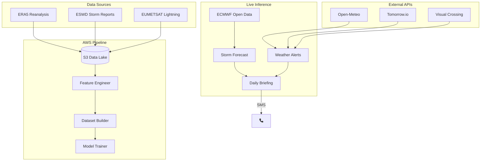
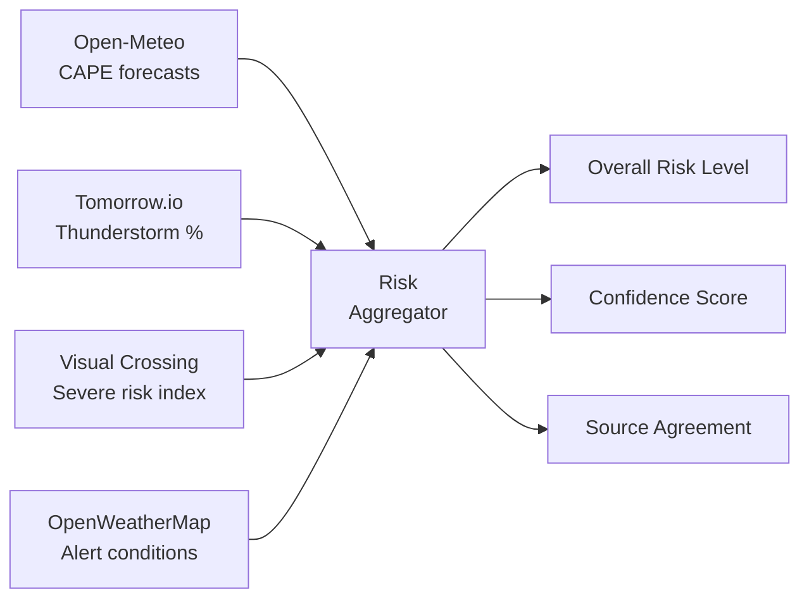

<!-- .slide: class="title-slide" -->

# Storm Tracking

### Automated Thunderstorm Prediction for Switzerland

<br>

*Daily SMS briefings for cycling safety*

<span class="small" style="color: rgba(255,255,255,0.7);">Built with AWS, LightGBM, and multi-source weather intelligence</span>

---

## The Problem

<div class="columns">
<div class="column">

### Switzerland's Weather

- Rapid convective storm development in summer
- Complex terrain funnels and amplifies storms
- 30-minute warning window is often too late

</div>
<div class="column">

### The Cyclist's Dilemma

- Plan rides 12-24h in advance <!-- .element: class="fragment" -->
- Need <span class="key-term">actionable</span> risk assessment, not raw data <!-- .element: class="fragment" -->
- Existing forecasts are regional, not personal <!-- .element: class="fragment" -->

</div>
</div>

<br>

> "Should I ride tomorrow afternoon?" needs a better answer than checking 5 weather apps.
<!-- .element: class="fragment" -->

---

## Product Vision

A fully automated pipeline that:

1. **Ingests** atmospheric data from ERA5 reanalysis and live weather APIs
2. **Predicts** thunderstorm probability at 0.25 grid resolution, 3h lead time <!-- .element: class="fragment" -->
3. **Aggregates** risk signals from multiple independent sources <!-- .element: class="fragment" -->
4. **Explains** why the model predicts storms (physical drivers) <!-- .element: class="fragment" -->
5. **Delivers** a plain-language SMS briefing every morning at 07:00 <!-- .element: class="fragment" -->

<br>

<span class="emphasis">No apps to check. No interpretation needed. Just ride or don't ride.</span>
<!-- .element: class="fragment" -->

---

## Architecture



---

## Data Pipeline

<div class="columns">
<div class="column">

### Training Data

| Source | Purpose |
|--------|---------|
| ERA5 | Atmospheric state (CAPE, shear, BLH) |
| ESWD | Verified storm reports (ground truth) |
| Lightning | Flash density clustering |

</div>
<div class="column">

### Feature Engineering

- **3x3 spatial patches** at each grid point
- **3 lead-time windows** (1h, 2h, 3h before)
- **Wind shear** between pressure levels
- **Temporal tendencies** (CAPE change rate)
- **Cyclical encoding** (time of day, season)

~50 features per sample

</div>
</div>

<br>

Dataset: stratified year-based split, quality-filtered, validated before training.

---

## ML Model

<div class="columns">
<div class="column">

### LightGBM Classifier

- Binary: storm / no-storm per grid cell
- 3:1 negative sampling ratio
- `pred_contrib=True` for SHAP explanations

### Explainability

Top physical drivers surfaced in briefings:

- "High instability energy (CAPE)"
- "Strong wind shear 925-700 hPa"
- "Low boundary layer height"

</div>
<div class="column">

### Grid Coverage

- Switzerland: 45.5N-48.25N, 5.5E-11E
- 0.25 resolution (~300 grid points)
- 6 forecast steps (9h-24h lead time)

### Output

- Per-cell storm probability
- High-risk cells with explanations
- Summary statistics

</div>
</div>

---

## Multi-Source Risk Aggregation



<br>

- **Consensus logic**: single high-risk source downgraded to moderate; multiple sources confirming = high confidence
- **24h window filter**: only surfaces threats in the next 24 hours
- **Per-location signals**: "Lugano (3/3 sources): Our model + Open-Meteo + Tomorrow.io agree"

---

## Daily Briefing

<div class="columns">
<div class="column">

### Pipeline

1. Load latest forecast from S3
2. Load latest risk assessment
3. Build source agreement summary
4. Format physical explanations
5. Generate natural language via **Amazon Nova Micro** (Bedrock)
6. Send SMS via **AWS SNS**

</div>
<div class="column">

### Example Output

> "Moderate storm risk for Lugano/Ticino this afternoon (14:00-18:00). Our model (45%), Open-Meteo (CAPE 1200 J/kg), and Tomorrow.io (55%) agree. Driven by high instability and strong low-level shear. Safe to ride this morning; avoid afternoon south of Alps."

Delivered at **07:00 CEST** daily.

</div>
</div>

---

## Infrastructure

<div class="columns">
<div class="column">

### AWS CDK (TypeScript)

- **ECS Fargate** tasks for each pipeline step
- **EventBridge** cron scheduling
- **S3** data lake with lifecycle policies
- **CloudWatch** alarms on task failures
- **SNS** for SMS delivery
- **Bedrock** for LLM inference

</div>
<div class="column">

### CI/CD

- **GitHub Actions** for test + deploy
- **pytest** with 90%+ coverage gate
- **ruff** linting
- **CDK diff/deploy** on push to main
- Fully automated, zero manual steps

```
push → test → lint → CDK deploy
```

</div>
</div>

<br>


---

## Next Steps

| Priority | Item | Status |
|----------|------|--------|
| 1 | Live ECMWF open data ingestion | Planned |
| 2 | Model training pipeline (automated retraining) | Planned |
| 3 | Backtesting framework (hindcast verification) | Planned |
| 4 | Multi-user support (different locations/thresholds) | Future |
| 5 | Web dashboard with interactive risk maps | Future |
| 6 | Push notifications via mobile app | Future |

<br>

### Key Improvements

- **Calibration**: probability reliability diagram against observed storms
- **Ensemble**: combine multiple ML models for uncertainty quantification
- **Nowcasting**: extend to 0-3h lead time using radar extrapolation
