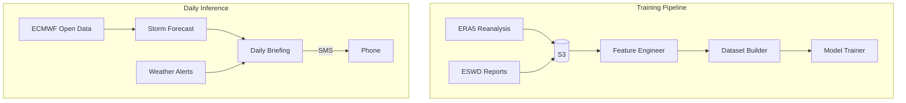
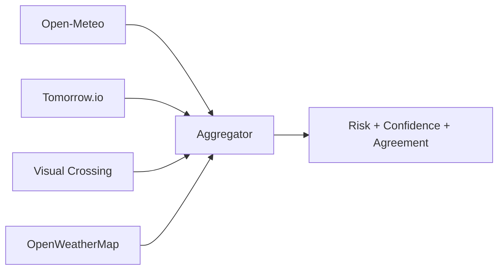

<!-- .slide: class="title-slide" -->

# Storm Tracking

### Automated Thunderstorm Prediction for Switzerland

<br>

*Daily SMS briefings for cycling safety*

<span class="small" style="color: rgba(255,255,255,0.7);">AWS CDK | LightGBM | Multi-source weather intelligence</span>

---

## The Problem

<div class="columns">
<div class="column">

**Switzerland's convective storms** develop rapidly in summer — complex terrain amplifies and funnels them unpredictably.

A cyclist planning tomorrow's ride needs a clear yes/no signal, not five apps showing conflicting data.

</div>
<div class="column">

**What we want:**

- Single daily SMS at 07:00
- Plain language: ride or don't ride
- Backed by multiple data sources
- Explains *why* (physical drivers)

</div>
</div>

---

## Architecture



---

## Data Pipeline

<div class="columns">
<div class="column">

**Training sources:**

- **ERA5** — atmospheric reanalysis (CAPE, shear, BLH, temperature, moisture)
- **ESWD** — verified storm reports (ground truth labels)
- **EUMETSAT** — lightning flash density

</div>
<div class="column">

**Feature engineering:**

- 3x3 spatial patches (0.25 grid)
- 3 lead-time windows (1h, 2h, 3h)
- Wind shear between pressure levels
- Temporal tendencies (rate of change)
- Cyclical time encoding

**~50 features per sample**

</div>
</div>

---

## LightGBM Model

<div class="columns">
<div class="column">

**Why LightGBM:**

- Fast training on tabular atmospheric data
- Handles missing values natively
- Built-in feature importance
- `pred_contrib=True` gives per-sample SHAP values without a separate library

</div>
<div class="column">

**Setup:**

- Binary classification: storm vs no-storm
- Per grid cell (0.25, ~300 points over CH)
- 3:1 negative sampling with temporal/spatial separation
- Year-stratified train/val/test split

</div>
</div>

---

## SHAP Explainability

LightGBM's `pred_contrib` returns the additive contribution of each feature to the log-odds prediction — equivalent to TreeSHAP values.

<div class="columns">
<div class="column">

**In the pipeline:**

```python
contribs = model.predict(
    row, pred_contrib=True
)
# contribs[:-1] = per-feature SHAP
# contribs[-1]  = base value (bias)
top = sorted(
    zip(features, contribs),
    key=lambda x: abs(x[1]),
    reverse=True
)[:3]
```

</div>
<div class="column">

**In the briefing:**

Raw features are mapped to plain language:

- `h1_cape_centre +0.8` → "high instability energy"
- `h2_wind_shear_925_700 +0.5` → "strong wind shear"
- `h1_blh_min -0.3` → "low boundary layer height"

SMS: *"Driven by high CAPE and strong low-level shear"*

</div>
</div>

---

## Multi-Source Risk Aggregation



<div class="slide-content">

- **Consensus logic**: single high-risk source → downgrade to moderate; multiple sources confirming → high confidence
- **24h window**: only surfaces threats in the actionable window
- **Source agreement**: *"Lugano (3/3 sources): model + Open-Meteo + Tomorrow.io agree"*

</div>

---

## Daily Briefing

<div class="columns">
<div class="column">

**Pipeline:**

1. Load forecast + alerts from S3
2. Build source agreement summary
3. Format SHAP explanations
4. Generate text via **Amazon Nova Micro** (Bedrock)
5. Send SMS via **AWS SNS**

Runs at **07:00 CEST** via EventBridge.

</div>
<div class="column">

**Example output:**

> Moderate storm risk Lugano/Ticino 14:00-18:00. Model (45%), Open-Meteo (CAPE 1200 J/kg), Tomorrow.io (55%) agree. High instability + strong low-level shear. Safe to ride this morning; avoid afternoon south of Alps.

</div>
</div>

---

## Infrastructure & CI/CD

<div class="columns">
<div class="column">

**AWS CDK (TypeScript):**

- ECS Fargate tasks per pipeline step
- EventBridge cron scheduling
- S3 data lake
- CloudWatch alarms
- SNS SMS delivery
- Bedrock LLM inference

</div>
<div class="column">

**CI/CD (GitHub Actions):**

- pytest with 90%+ coverage gate
- ruff linting
- CDK build + deploy on push to main
- Fully automated, zero manual steps


</div>
</div>

---

## Next Steps

<div class="slide-content">

| Priority | Item |
|----------|------|
| 1 | Live ECMWF open data ingestion |
| 2 | Automated model retraining pipeline |
| 3 | Backtesting framework (hindcast verification) |
| 4 | Probability calibration (reliability diagrams) |
| 5 | Multi-user support (locations / thresholds) |
| 6 | Web dashboard with interactive risk maps |

**Key technical improvements:** ensemble models for uncertainty quantification, radar-based nowcasting (0-3h), and a feedback loop where observed storms retrain the model.

</div>
